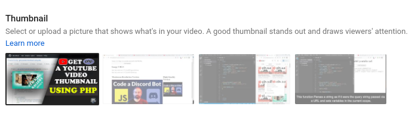

# get-youtube-thumbnail-using-php
A PHP program that extracts a thumbnail from any youtube video.


This format represents the screen above.

```
https://img.youtube.com/vi/<--put-youtube-video-id-here-->/0.jpg
https://img.youtube.com/vi/<--put-youtube-video-id-here-->/1.jpg
https://img.youtube.com/vi/<--put-youtube-video-id-here-->/2.jpg
https://img.youtube.com/vi/<--put-youtube-video-id-here-->/3.jpg
```

Those 4 pictures (0,1,2,3.jpg) above are found in the thumbnail section when you are uploading or editing a video on youtube.

Example:



## Let me break down this for you;

* 0.jpg - This is the custom thumbnail/picture you upload in case you don't use the auto-generated thumbnails by youtube.
* 1.jpg - This is one of the auto-generated thumbnails by youtube when you upload a video.
* 2.jpg - The same as image 1.
* 3.jpg - The same as image 1.

For More Visit [ostoncodecypher.com](https://ostoncodecypher.com){:target="_blank"}
